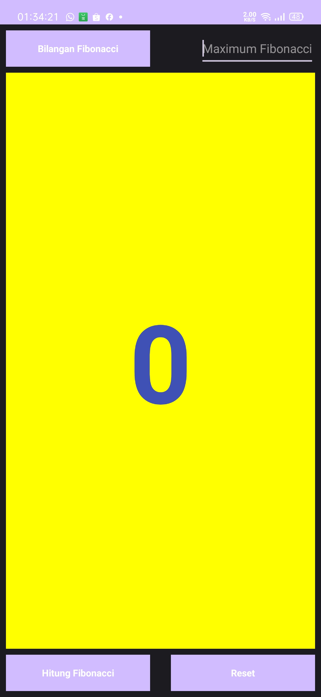
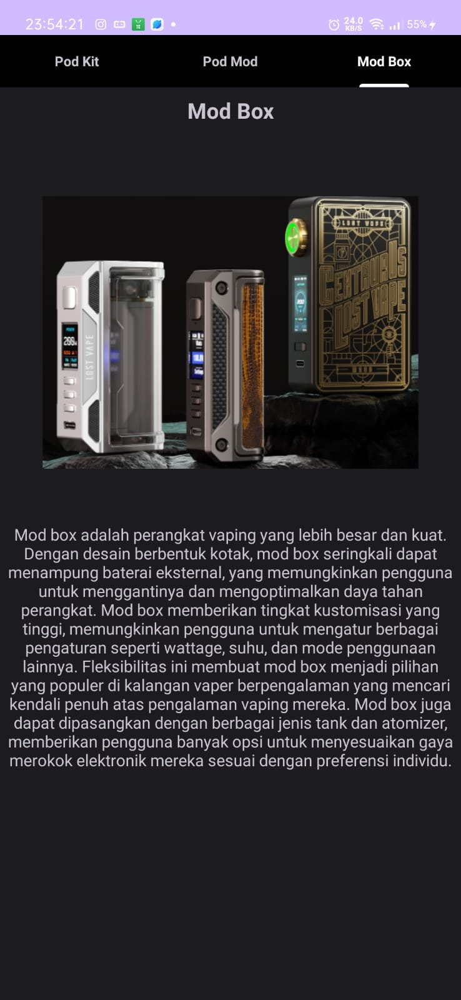
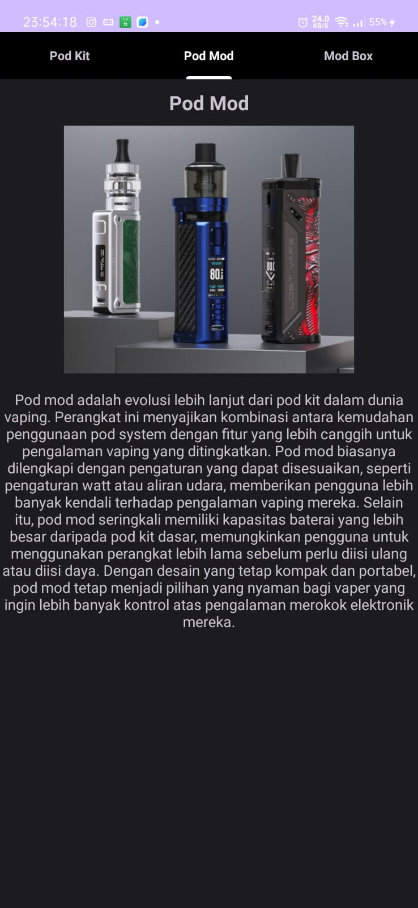

# Nama      : Muhammad albedri
# NIM       :312210290
# Kelas     :TI.22.A3

# Hasil project pemrograman mobile dari pertemuan 1 samapai 15

Berikut adalah hasil laporan aplikasi yang telah saya buat:
* Launcher splash : aplikasi ini mengeluarkan gambar dan logo kita.

* Home page : Aplikasi ini mengeluarkan tampilan menu.

* Hello toast : Aplikasi ini mengeluarkan text Bagaimana Kabar Anda Hari Ini.

* Bilangan Fibonacci : Aplikasi ini dapat menghitung bilangan fibonacci, kita juga bisa menentukan maximum bilangannya, dan juga bisa mereset ulang bilangannya.

* Kasus Sianida: Aplikasi ini dapat memberikan informasi berita Kasus Sianida.

* Two Activity: Aplikasi ini merupakan berbentuk pesan yang bisa berpindah dari activity satu ke activity kedua.

* Set Alarm: Aplikasi ini dapat mengatur alarm secara otomatis.

* Show Maps: Aplikasi ini dapat memberikan tujuan peta yang sudah kita tentukan.

* Fragment: Aplikasi ini dapat memberikan informasi, dan apabila di klik gambarnya dapat mengeluarkan vidio/trailer.

